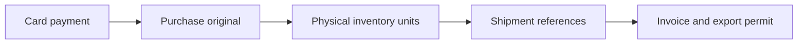

# Purchase and export workflow

The purchase-workflow page follows a canonical card payment through four stages:

Each item or stock unit advances separately. One payment can have several exports,
and a shipment can contain stock from several purchases. Missing sibling items do
not prevent confirmed units from advancing. Completion describes connected purchase
and export evidence; it does not decide accounting or tax treatment.

The website and records run on the hosting machine. `finalization-worker/run.mjs`
runs on the browser machine. It reads the existing research connection from its
encrypted vault and its own Intras connection from the workflow vault. No credentials
belong in this repository. The owner configures the period, financial accounts and
authorized worker on the page. Activation requires a recent worker heartbeat with
the four main capabilities. The first run starts at the following midnight in Japan.

Each JST date has one durable run. An expired worker lease can resume that run using
its saved source snapshots and completed downloads. A run ends after two hours or
the next midnight; unfinished work remains pending. Known purchase continuations run
before receipt and AI investigation. Investigations prioritize older unchecked work.

Only a qualified, current-day source check counts as a failed night. The counter is
per stage/unit and advances at most once per JST date. Ten failed nights require
manual review. Missing shipments wait without consuming failures and receive a
reminder after 30 days. Login failures, incomplete sources and missing dependencies
do not count. Contradictions require immediate review. Retrying requires a reason
and preserves the cumulative history.

AI compares purchase candidates and cites saved facts. Equal dates, amounts or
products never authorize an unattended association. Automatic connection requires
an identified ISSEY merchant, an exact order reference previously confirmed for that
payment, the original files and matching payment amount. Other candidates need owner confirmation. The owner can
answer in the page; the answer applies to that payment and is reconsidered overnight.

Offline receipts and item tags retain absent prices, dates and quantities. Owner
confirmed quantities and card-statement totals remain distinct from printed evidence.
Offline purchases have no fabricated online order number. Physical allocations first
resolve JAN items, then propose the remaining stock. The JAN adapter is **not connected
in this release**: unresolved JAN items block remainder inference. A JAN identifies
a product variant, not a unique physical inventory unit.

The offline search recognizes TOKYO labels with or without a space before the date.
It includes exact printed/resolved models at any date and allocation/storage dates
from 14 days before to 45 days after the payment as search hints. This is not proof of
purchase date or exhaustive absence. Context includes at most 200 stock records;
truncation is visible and blocks remainder inference. Duplicate or already assigned
stock IDs cannot be allocated. Inferred stock associations require owner confirmation.

Intras capture uses the official native invoice download and export permit print
view. Official source fields and an independent PDF reading must agree on shipment
identity and declared value. Unsupported layouts require attention. Customer declared
values are preserved. Hashed originals and source evidence remain attached to the
records; existing verified documents can serve newly connected units of that shipment.

Evidence corrections work for posted payments without changing the ledger. Original
files and decision history remain. An export or return allocation must be corrected
before its purchase connection can be released. Canonical forecast/actual references
continue to determine payment identity, preventing a second purchase from the later
statement import.

Verification: build the Nuxt app, run the workflow/export unit suites and
`OMF_TEST_WORKFLOW_ONLY=1 node scripts/finance-integration.cjs` in an isolated test
environment. `OMF_TEST_WORKFLOW_BROWSER=1` also checks the page in real Chrome.
The worker integration injects a disconnect and verifies that recovery does not
repeat downloads, model work, purchase connections or export allocations.
